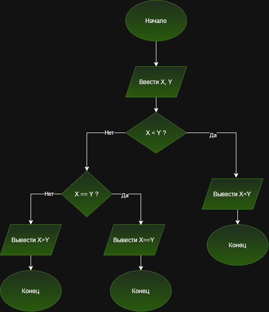

# Лабораторная работа №6

## Тема: Сравнение двух чисел

### Задание

Написать программу, которая выводит результат сравнения двух введенных пользователем чисел в виде математического выражения:

```text
X<Y
```

или

```text
X=Y
```

или

```text
X>Y
```

## Цель работы

Научиться использовать условные операторы языка C для сравнения двух чисел и организовывать ветвление программы с помощью конструкций `if`, `else if` и `else`.

## Условие задачи

Пользователь вводит два числа `X` и `Y`.

Программа должна определить соотношение между ними и вывести соответствующее математическое выражение:

* если `X` меньше `Y`, вывести `X<Y`;
* если `X` равно `Y`, вывести `X=Y`;
* если `X` больше `Y`, вывести `X>Y`.

## Используемые операторы

Для решения задачи используются следующие операторы сравнения:

| Оператор | Назначение |
| -------- | ---------- |
| `<`      | меньше     |
| `==`     | равно      |
| `>`      | больше     |

В языке C оператор `==` используется для проверки равенства двух значений.

## Алгоритм решения

1. Объявить две целочисленные переменные `X` и `Y`.
2. Ввести значения `X` и `Y` с клавиатуры.
3. Проверить условие `X < Y`.
4. Если условие истинно, вывести выражение `X<Y`.
5. Если условие ложно, проверить `X == Y`.
6. Если второе условие истинно, вывести выражение `X=Y`.
7. Если оба условия ложны, значит `X > Y`, поэтому вывести выражение `X>Y`.
8. Завершить программу.

## Блок-схема



## Исходный код программы

```c
#include <stdio.h>

int main()
{
    int X, Y;

    printf("Введите два числа X и Y: ");
    scanf("%d %d", &X, &Y);

    if (X < Y)
    {
        printf("%d<%d\n", X, Y);
    }
    else if (X == Y)
    {
        printf("%d=%d\n", X, Y);
    }
    else
    {
        printf("%d>%d\n", X, Y);
    }

    return 0;
}
```

## Объяснение программы

Сначала подключается библиотека:

```c
#include <stdio.h>
```

Она необходима для использования функций `printf()` и `scanf()`.

Затем создаются две целочисленные переменные:

```c
int X, Y;
```

После этого пользователь вводит два числа:

```c
scanf("%d %d", &X, &Y);
```

Далее программа проверяет первое условие:

```c
if (X < Y)
```

Если `X` меньше `Y`, программа выводит:

```c
printf("%d<%d\n", X, Y);
```

Если первое условие не выполняется, программа проверяет:

```c
else if (X == Y)
```

Если числа равны, выводится:

```text
X=Y
```

Если оба предыдущих условия ложны, выполняется блок `else`. В этом случае `X` обязательно больше `Y`, поэтому выводится:

```text
X>Y
```

## Проверка программы

### Тест 1

Входные данные:

```text
5 10
```

Результат:

```text
5<10
```

### Тест 2

Входные данные:

```text
8 8
```

Результат:

```text
8=8
```

### Тест 3

Входные данные:

```text
20 7
```

Результат:

```text
20>7
```

### Тест 4

Входные данные:

```text
-5 3
```

Результат:

```text
-5<3
```

### Тест 5

Входные данные:

```text
0 0
```

Результат:

```text
0=0
```

## Структура проекта

```text
lab5/
├── README.md
├── home5.c
└── block_scheme.png
```

## Вывод

В ходе выполнения лабораторной работы была разработана программа на языке C, которая сравнивает два введенных пользователем числа. Для организации ветвления использованы условные конструкции `if`, `else if` и `else`, а для сравнения чисел — операторы `<` и `==`. В результате программа выводит одно из трех математических выражений: `X<Y`, `X=Y` или `X>Y`.

## Разработчик

Орлов Даниил, группа БИЦТ-262
